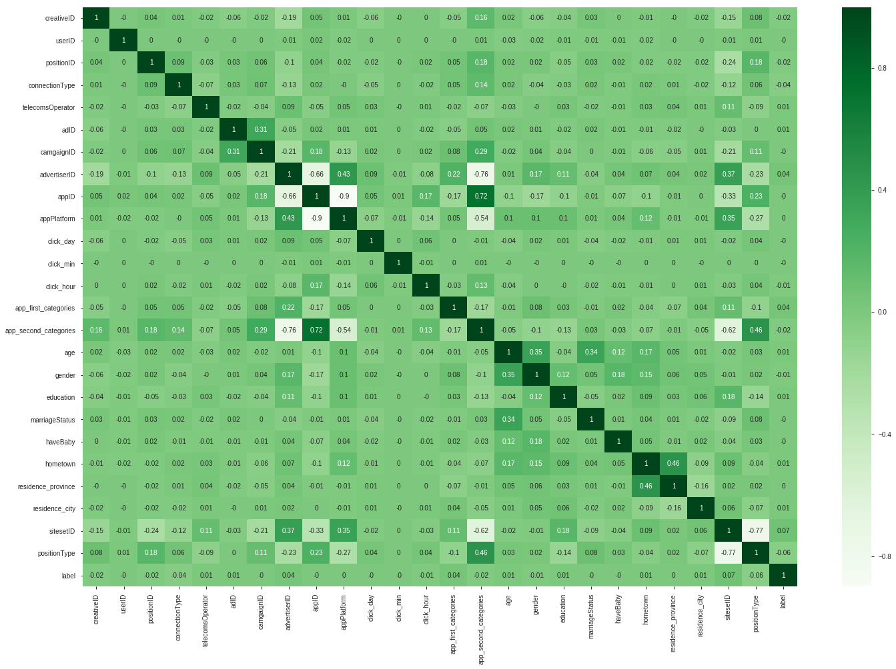

# 广告转化预估

标签：DeepFM

## 1、背景和目标

背景：广告是当今互联网商业变现最重要的模式之一，通过根据用户兴趣实时地定向投送广告，可以提高广告的转化率，提高广告营收。

目标：通过所提供的广告数据建立ML模型，预估出用户点击广告后是否会有效激活广告（成为付费用户）。

## 2、分析方法

* FM算法能捕捉到低阶的feature pair信息，但无法捕捉到高阶的feature pair信息

* 神经网络可以捕捉到高阶的feature pair信息

* 将FM与神经网络进行共享输入，不需要额外的特征工程，同时捕捉低阶和高阶的feature pair信息

## 3、数据清洗

### 3.1、查看变量的相关关系

```python
df_train = x_train.copy()
df_train['label'] = y_train
plt.figure(figsize = (24, 16))
sns.heatmap(df_train.corr().round(2), annot = True, cmap = 'Greens')
```



* app_second_categories与positionType和sitesetID和advertiserID和appID和appPlatform具有强相关关系

* advertiserID与appID与appPlatform相互具有强相关关系
* positionType与sitesetID具有强负相关关系

### 3.2、数据建模

```python
train_data.label.value_counts()
```

```
0    3656266
1      93262
Name: label, dtype: int64
```

* 便签比为40:1，数据类别严重不均衡，考虑到样本量较大，对现有训练数据采用欠采样。

```python
from imblearn.under_sampling import NearMiss

nm = NearMiss(version = 3, random_state=100, n_jobs = -1)
x_train_resam, y_train_resam = nm.fit_sample(x_train, y_train)
```

### 3.3、对ID类数据做LabelEncoder

```python
from sklearn.preprocessing import LabelEncoder

le = LabelEncoder()

x_train_resam_le = x_train_resam.copy()
for col in x_train_resam.columns:
    x_train_resam_le[col] = le.fit_transform(x_train_resam[col])
```

## 4、数据建模

### 4.1、构建特征字典

```python
feature_dict = {}
total_feature = 0

for col in x_train_resam.columns:
    unique_val = x_train_resam[col].unique()
    feature_dict[col] = dict(zip(unique_val, range(total_feature, total_feature + len(unique_val))))
    total_feature += len(unique_val)

feature_value = x_train_resam.copy()
feature_index = x_train_resam.copy()

for col in x_train_resam.columns:
    feature_value[col] = 1
    feature_index[col] = feature_index[col].map(feature_dict[col])
```

### 4.2、定义参数

```python
import tensorflow as tf
import numpy as np
import pandas as pd

dfm_params = {
    'use_fm': True,
    'use_deep': True,
    'embedding_size': 8,
    'dropout_fm': [1.0, 1.0],
    'deep_layers': [32, 32],
    'dropout_deep': [0.5, 0.5, 0.5],
    'deep_layer_activation': tf.nn.relu,
    'opoch': 30,
    'bach_size': 1024,
    'learning_rate': 0.001,
    'optimizer': 'adam',
    'batch_norm_dacay': 0.995,
    'l2_reg': 0.01,
    'verbose': True,
    'eval_metric': 'logloss',
    'random_seed': 100
}
dfm_params['feature_size'] = total_feature
dfm_params['field_size'] = len(x_train_resam.columns)

with tf.device('/gpu:0'):
    feat_index = tf.placeholder(tf.int32, shape = [None, None], name = 'feat_index')
    feat_value = tf.placeholder(tf.float32, shape = [None, None], name = 'feat_value')

    label = tf.placeholder(tf.float32, shape = [None, 1], name = 'label')

    weights = dict()

    ##embeddings
    weights['feature_embeddings'] = tf.Variable(
        tf.random_normal(
            [dfm_params['feature_size'], 
             dfm_params['embedding_size']], 0.0, 0.01), name = 'feature_embeddings')
    weights['feature_bias'] = tf.Variable(
        tf.random_normal(
            [dfm_params['feature_size'], 1], 
            0.0, 0.01), name = 'feature_bias')###weights[''feature_bias]是一次项的权重

    ##deep layers
    num_layer = len(dfm_params['deep_layers'])
    input_size = dfm_params['field_size'] * dfm_params['embedding_size']
    glorot = np.sqrt(2.0 / (input_size + dfm_params['deep_layers'][0]))

    weights['layer_0'] = tf.Variable(
        np.random.normal(loc = 0, scale = glorot, size = (
            input_size, dfm_params['deep_layers'][0])), dtype = np.float32)
    weights['bias_0'] = tf.Variable(
        np.random.normal(
            loc = 0, scale = glorot, size = (
                1, dfm_params['deep_layers'][0])), dtype = np.float32)

    for i in range(1, num_layer):
        glorot = np.sqrt(2.0 / (dfm_params['deep_layers'][i - 1] + dfm_params['deep_layers'][i]))
        weights['layer_%d'%(i)] = tf.Variable(
            np.random.normal(
                loc = 0, scale = glorot, 
                size = (dfm_params['deep_layers'][i - 1], 
                        dfm_params['deep_layers'][i])), dtype = np.float32)
        weights['bias_%d'%(i)] = tf.Variable(
            np.random.normal(
                loc = 0, scale = glorot, size = (
                    1, dfm_params['deep_layers'][i])), dtype = np.float32)

    ##concat layer
    if dfm_params['use_fm'] and dfm_params['use_deep']:
        input_size = dfm_params[
            'field_size'] + dfm_params['embedding_size'] + dfm_params['deep_layers'][-1]
    elif dfm_params['use_fm']:
        input_size = dfm_params['field_size'] + dfm_params['embedding_size']
    else:    
        input_size = dfm_params['deep_layers'][-1]

    glorot = np.sqrt(2.0 / (input_size + 1))
    weights['concat_projection'] = tf.Variable(
        np.random.normal(
            loc = 0, scale = glorot, size = [input_size, 1]), dtype = np.float32)
    weights['concat_bias'] = tf.Variable(tf.constant(0.01), dtype = np.float32)
```

### 4.3、构建模型

```python
with tf.device('/gpu:0'):
##embeddings
    embeddings = tf.nn.embedding_lookup(weights['feature_embeddings'], feat_index)
    reshaped_feat_value = tf.reshape(feat_value, 
                                     shape = [-1, dfm_params['field_size'], 1])
    print(reshaped_feat_value)
    embeddings = tf.multiply(embeddings, reshaped_feat_value)

    ##fm
    fm_first_order = tf.nn.embedding_lookup(weights['feature_bias'], feat_index)
    fm_first_order = tf.reduce_sum(tf.multiply(fm_first_order, reshaped_feat_value), 2)

    summed_features_emb = tf.reduce_sum(embeddings, 1)
    summed_features_emb_square = tf.square(summed_features_emb)

    squared_features_emb = tf.square(embeddings)
    squared_features_emb_sum = tf.reduce_sum(squared_features_emb, 1)

    fm_second_order = 0.5 * tf.subtract(
        summed_features_emb_square, squared_features_emb_sum)

    ##deep
    y_deep = tf.reshape(
        embeddings, shape = [-1, dfm_params[
            'field_size'] * dfm_params['embedding_size']])

    for i in range(len(dfm_params['deep_layers'])):
        y_deep = tf.add(tf.matmul(y_deep, 
                                  weights['layer_%d'%(i)]), weights['bias_%d'%(i)])
        y_deep = tf.nn.relu(y_deep)

    ##final layer
    if dfm_params['use_fm'] and dfm_params['use_deep']:
        concat_input = tf.concat([fm_first_order, fm_second_order, y_deep], axis = 1)
    elif dfm_params['use_fm']:
        concat_input = tf.concat([fm_first_order, fm_second_order], axis = 1)
    else:
        concat_input = y_deep

    out = tf.nn.sigmoid(
        tf.add(tf.matmul(concat_input, weights['concat_projection']),
               weights['concat_bias']))

    loss = tf.losses.log_loss(tf.reshape(label, (-1,1)), out)
    optimizer = tf.train.AdamOptimizer(learning_rate = dfm_params['learning_rate'], 
                                       beta1 = 0.9, beta2 = 0.999, 
                                       epsilon = 1e-8).minimize(loss)
```

output: logloss is 0.15

